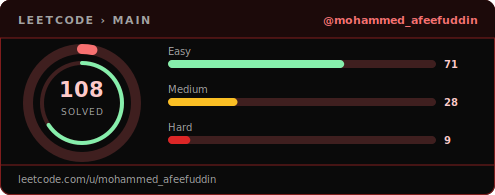
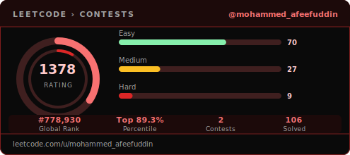

<div align="center">

</div>

<!-- AFEEF-CRYPTO — PROFILE README · name tag pattern after github.com/Morizz00/Morizz00 -->

<div align="center">

<pre>
╔══════════════════════════════════════════════════════════╗
║  A F E E F · Mohammed Afeefuddin                         ║
╠══════════════════════════════════════════════════════════╣
 █████╗ ███████╗███████╗███████╗███████╗
██╔══██╗██╔════╝██╔════╝██╔════╝██╔════╝
███████║█████╗  █████╗  █████╗  █████╗  
██╔══██║██╔══╝  ██╔══╝  ██╔══╝  ██╔══╝  
██║  ██║██║     ███████╗███████╗██║     
╚═╝  ╚═╝╚═╝     ╚══════╝╚══════╝╚═╝     
╚══════════════════════════════════════════════════════════╝
</pre>

### Tech Co-founder Engineer · AI systems & backends · CS @ MJCET · Hyderabad

</div>

<div align="center">

```
 ░▒▓█  VENTURES  RoundtableCI · CloveCI · PrepHelp · Forklore · GRADE · Hyderabad  █▓▒░
 ░▒▓█  STACK     PostgreSQL · pgvector · LangChain · RAG · Django · FastAPI · REST   █▓▒░
```

<a href="https://readme-typing-svg.demolab.com"></a>

<br/>

[](https://github.com/Afeef-crypto)
[](https://www.linkedin.com/in/mohammed-afeefuddin-188aa5395/)
[](https://leetcode.com/u/mohammed_afeefuddin/)

<br/>


</div>


---

## About

CS undergraduate and **Tech Co-founder Engineer** focused on turning ideas into working software. Based in **Hyderabad, India**, I build **production-grade RAG & vector retrieval**, **AI orchestration**, and **multi-model evaluation** infrastructure.

---

## `whoami`

```ts
const afeef = {
  name: "Mohammed Afeefuddin",
  role: ["Tech Co-founder @ RoundtableCI", "Lead Engineer @ CloveCI"],
  location: "Hyderabad, Telangana, India",
  education: "B.E. Computer Science — MJCET (2023 – 2027)",
  domains: ["AI systems", "RAG pipelines", "Vector DBs", "Backend & product"],
  currently: "Y Combinator W'25 and S26 applicant",
  focus: ["Product engineering", "Startup execution", "Algorithms & problem solving"],
};
```

---

## What I'm building

<table>
<tr>
<td width="50%" valign="top">

### RoundtableCI
**AI orchestration & platform**

Co-founding engineer on model routing, evaluation, and production backends — **PostgreSQL**, **pgvector**, **LangChain-style** pipelines, and infrastructure that survives real traffic.

[](https://github.com/Afeef-crypto)
[](https://www.ycombinator.com)

Also shipping as **Lead Engineer @ CloveCI** on adjacent product and platform work.

</td>
<td width="50%" valign="top">

### PrepHelp
**AI study platform — syllabus → structured learning**

Built for real students and real syllabi: **PDF → structured JSON → pgvector** ingestion, **RAG** for exam prep, and pipelines you can dry-run and trust. Osmania University–aligned product story — the kind of benchmark problem that informs serious AI infra.

[prephelp.in](https://www.prephelp.in/)

[](https://www.prephelp.in/)

</td>
</tr>
<tr>
<td width="50%" valign="top">

### Forklore
**Writers’ companion MVP — collaborative storytelling**

A platform where writers publish stories and readers create **forks** (alternate versions). Tracks fork trees, credit attribution, discovery, and AI-assisted writing. Stack highlights: **Vite + React + TypeScript**, **Tailwind + shadcn/ui**, **TipTap** editor, **Go** API gateway, **Node** BFF, **PostgreSQL**, **Redis**, **Pinecone** (embeddings roadmap).

Project spec, **Sprint 1–14** timeline, and **repo layout** (`backend/` Go gateway, `frontend/` Vite+React+TS, Docker, PostgreSQL schema) live in the **Forklore** root `README` wherever you host that monorepo — link it here once the public repo is up.

</td>
<td width="50%" valign="top">

### GRADE
**Automated handwritten answer sheet grading**

CV + NLP pipeline: ingest scanned sheets, segment questions, multi-tier OCR (cloud → PaddleOCR → TrOCR), then **Sentence-BERT** semantic scoring for partial credit and paraphrasing. **FastAPI** backend, **web dashboard** with score overlays, **PDF** reports — academic mini project @ MJCET.

- [github.com/Afeef-crypto/GRADE](https://github.com/Afeef-crypto/GRADE)

[](https://github.com/Afeef-crypto/GRADE)

</td>
</tr>
</table>

---

## Experience & education

| | |
|:--|:--|
| **RoundtableCI** – *Tech Co-Founder* | September 2025 – Present · Hyderabad |
| **CloveCI** — *Lead Engineer* | Aug 2025 – Present · Hyderabad |
| **GDG On Campus – MJCET** — *DSA Core Member* | Nov 2025 – Present |
| **GDG On Campus – MJCET** — *Member* | Dec 2023 – Nov 2024 |
| **Muffakham Jah College of Engineering & Technology** — *B.E. Computer Science* | 2023 – 2027 |

---

## GitHub stats

<div align="center">

<table width="100%">
<tr>
<td width="50%" valign="top">

</td>
<td width="50%" valign="top">

</td>
</tr>
</table>


<br/>


</div>

---

## LeetCode

Custom SVG cards refresh on a schedule via [`.github/workflows/update-stats.yml`](.github/workflows/update-stats.yml). Profile: [**mohammed_afeefuddin**](https://leetcode.com/u/mohammed_afeefuddin/).

<!-- LEETCODE-MAIN:START -->
<div align="center">
  <a href="https://leetcode.com/u/mohammed_afeefuddin/">
    
  </a>
</div>
<!-- LEETCODE-MAIN:END -->

<!-- LEETCODE-CONTESTS:START -->
<div align="center">
  <a href="https://leetcode.com/u/mohammed_afeefuddin/">
    
  </a>
</div>
<!-- LEETCODE-CONTESTS:END -->

---

## Contribution snake

Animated grid from [**Platane/snk**](https://github.com/Platane/snk), regenerated every six hours via [`.github/workflows/snake.yml`](.github/workflows/snake.yml) (SVGs live on the `output` branch).

<div align="center">
<picture>
  <source media="(prefers-color-scheme: dark)" srcset="https://raw.githubusercontent.com/Afeef-crypto/Afeef-crypto/output/github-contribution-grid-snake-dark.svg" />
  <source media="(prefers-color-scheme: light)" srcset="https://raw.githubusercontent.com/Afeef-crypto/Afeef-crypto/output/github-contribution-grid-snake.svg" />
  
</picture>
</div>

---

## Quick tech overview

I work across **AI/ML** and full-stack systems. On the client: **HTML**, **CSS**, **JavaScript**. On the server: **Python** (**Django**, **FastAPI**), **Java**, and **REST APIs**. For **AI infrastructure**: **OpenAI**, **Anthropic Claude**, **Google Gemini**, **LangChain**, **Hugging Face**. For **ML & data**: **pandas**, **scikit-learn**, **OpenCV**, **PyTorch**. Data: **PostgreSQL** (**pgvector**), **MySQL**, **Pinecone**. Delivery: **Docker**, **Kubernetes**, **GitHub Actions**, **Git**. Cloud: **Google Cloud**, **AWS**.

---

## Tech stack

Rich layout: **capsule-render** headers, **typing SVG** lines, **Tech Stack Generator** icons, and alternating **dividers** (thin rules + non–“lion” GIF accents from common profile templates). Peek banner GIF: [`.github/workflows/build-peek-gif.yml`](.github/workflows/build-peek-gif.yml).

<div align="center">


<br/>

<sub>Animated icons · <a href="https://techstack-generator.vercel.app/">Tech Stack Generator</a></sub><br/>


</div>


### Languages & web

<div align="center">


<br/>


</div>


### Backend & APIs

<div align="center">


<br/>


<br/>


</div>


### AI infrastructure

<div align="center">


<br/>


</div>


### Machine learning & data science

<div align="center">


<br/>


<br/>


</div>


### Databases & vector search

<div align="center">


<br/>


<br/>


</div>


### DevOps & delivery

<div align="center">


<br/>


</div>


### Cloud

<div align="center">


<br/>


<sub>Google Cloud · AWS</sub>

</div>


### Development tools

<div align="center">


<br/>


</div>

---

## Currently

- Shipping product and engineering work as **co-founder** at **RoundtableCI** and **Lead engineer** at **CloveCI**
- Levelling up **DSA** and supporting peers as **DSA Core** with **GDG On Campus – MJCET**
- Completing **B.E. Computer Science** at **MJCET**
- Exploring the latest tech concerning GenAi and Deeplearning
---

<div align="center">


<br/>


</div>
